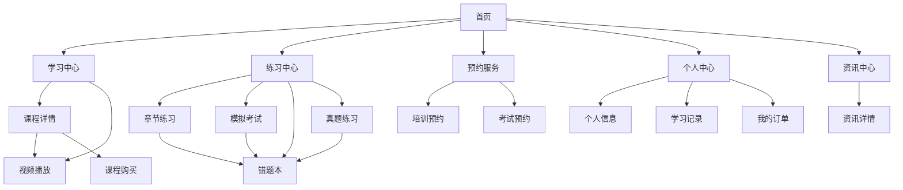

# 易飞行 - 无人机学习与考试预约小程序产品需求文档

## 1. 产品概述

易飞行是一款专注于无人机学习与考试预约的微信小程序，为准备获取无人机执照的学员提供一站式学习解决方案。产品整合了课程学习、模拟练习、培训预约、考试预约等核心功能，帮助用户高效备考并顺利获得无人机执照。

* 解决问题：无人机学习资源分散、考试预约流程复杂、学习效果难以跟踪

* 目标用户：准备获取VLOS/BVLOS/教员执照的个人学员和企业员工

## 2. 核心功能

### 2.1 用户角色

| 角色   | 注册方式   | 核心权限               |
| ---- | ------ | ------------------ |
| 普通学员 | 微信授权登录 | 浏览免费课程、基础练习、查看成绩   |
| 报名学员 | 实名认证升级 | 完整课程学习、付费模拟考试、预约服务 |
| 购课学员 | 会员套餐购买 | 专属题库、无限模拟、专业答疑服务   |

### 2.2 功能模块

易飞行小程序包含以下核心页面：

1. **首页**：学习路径引导、快速功能入口、最新资讯、继续学习
2. **学习中心**：课程分类浏览、视频播放、课程详情、直接购买
3. **练习中心**：章节练习、模拟考试、错题本管理、真题练习
4. **预约服务**：培训班预约、考试报名、时间安排
5. **个人中心**：学习记录、订单管理、个人信息设置
6. **资讯中心**：行业资讯、政策解读、考试动态

### 2.3 页面详情

| 页面名称 | 模块名称  | 功能描述                       |
| ---- | ----- | -------------------------- |
| 首页   | 轮播横幅  | 展示活动信息、重要通知和推广内容           |
| 首页   | 快速入口  | 提供模拟考试、章节练习、预约培训等快捷入口      |
| 首页   | 继续学习  | 显示最近学习的课程，支持一键继续           |
| 首页   | 最新资讯  | 展示行业动态、政策解读等资讯信息           |
| 学习中心 | 课程列表  | 按分类显示课程，支持筛选和搜索            |
| 学习中心 | 课程详情  | 展示课程信息、讲师介绍、章节目录、学员评价      |
| 学习中心 | 视频播放器 | 支持倍速播放、进度记录、章节切换功能         |
| 学习中心 | 课程购买  | 在课程详情页直接购买，模拟支付流程          |
| 练习中心 | 章节练习  | 按知识点分类练习，实时显示正确率           |
| 练习中心 | 模拟考试  | 全真模拟考试环境，计时答题和成绩分析         |
| 练习中心 | 错题本   | 收集错题，支持重复练习和知识点复习，包含错题状态管理 |
| 练习中心 | 真题练习  | 历年真题练习，提供标准答案和解析           |
| 预约服务 | 培训预约  | 选择培训机构、时间和课程类型进行预约         |
| 预约服务 | 考试预约  | 选择考点、场次进行正式考试报名            |
| 个人中心 | 个人信息  | 查看和编辑用户基本信息、头像设置           |
| 个人中心 | 学习记录  | 展示学习时长、课程进度、练习成绩           |
| 个人中心 | 我的订单  | 查看购买记录、预约记录等订单信息           |
| 资讯中心 | 资讯列表  | 展示行业资讯、政策解读、考试动态           |
| 资讯中心 | 资讯详情  | 查看资讯详细内容、相关推荐              |

## 3. 核心流程

### 用户学习流程

1. 新用户进入小程序 → 微信授权登录 → 浏览课程和资讯
2. 免费课程学习 → 试看付费课程第一章节 → 章节练习巩固
3. 课程详情页直接购买 → 模拟支付流程 → 解锁全部章节
4. 系统学习课程 → 视频播放进度跟踪 → 完成课程评价
5. 练习中心刷题 → 模拟考试测试 → 错题本复习
6. 预约线下培训 → 参加培训 → 预约正式考试

### 预约服务流程

**培训预约流程：**
选择培训类型 → 查看机构和时间 → 填写报名信息 → 支付费用 → 确认预约 → 参加培训

**考试预约流程：**
选择考试等级 → 选择考点和时间 → 确认个人信息 → 支付报名费 → 生成准考证 → 参加考试

## 4. 用户界面设计

### 4.1 设计风格

* **主色调**：蓝色渐变(#4A90E2 到 #7BB3F0)，体现科技感和专业性

* **辅助色**：白色(#FFFFFF)、浅灰(#F5F5F5)、深灰(#333333)

* **按钮样式**：圆角矩形，渐变背景，微阴影效果

* **字体**：系统默认字体，标题16-18px，正文14px，辅助文字12px

* **布局风格**：卡片式设计，底部导航栏，顶部状态栏

* **图标风格**：线性图标配合面性图标，简洁现代

### 4.2 页面设计概览

| 页面名称 | 模块名称  | UI元素                  |
| ---- | ----- | --------------------- |
| 首页   | 轮播横幅  | 蓝色渐变背景，白色文字，圆角设计      |
| 首页   | 快速入口  | 2x2网格布局，彩色图标，白色背景圆角卡片 |
| 首页   | 继续学习  | 课程卡片，封面图+进度条，阴影效果     |
| 首页   | 最新资讯  | 列表布局，缩略图+标题+时间，简洁设计   |
| 学习中心 | 课程卡片  | 封面图+标题+价格，已购买/免费状态标识  |
| 学习中心 | 课程详情  | 大图封面，讲师信息，章节目录，评价展示   |
| 学习中心 | 底部操作栏 | 固定底部，试看/购买按钮，渐变背景     |
| 练习中心 | 功能卡片  | 图标+标题+描述，统计数据展示       |
| 练习中心 | 答题界面  | 简洁布局，大号选项按钮，计时器显示     |
| 预约服务 | 机构卡片  | 机构信息，评分展示，立即报名按钮      |
| 个人中心 | 用户信息  | 头像+昵称，登录状态，设置入口       |
| 个人中心 | 功能列表  | 图标+文字，右箭头，分组显示        |
| 资讯中心 | 资讯列表  | 缩略图+标题+摘要+时间，卡片布局     |
| 资讯中心 | 资讯详情  | 大图+标题+正文，标签展示，相关推荐    |

### 4.3 响应式设计

产品采用移动端优先设计，适配各种手机屏幕尺寸，支持触摸操作优化。采用底部导航栏设计，固定底部操作栏确保核心功能易于访问。界面元素使用相对单位和弹性布局，确保在不同设备上都有良好的用户体验。

## 5. 核心功能特色

### 5.1 课程购买流程优化

* **一站式购买**：在课程详情页直接完成购买，无需跳转到单独支付页面

* **模拟支付**：集成模拟支付流程，支持支付状态实时反馈

* **即时解锁**：购买成功后立即解锁全部章节，提升用户体验

* **状态管理**：智能识别课程购买状态，显示对应的操作按钮

### 5.2 学习进度跟踪

* **章节进度**：实时记录每个章节的学习进度

* **视频续播**：支持视频播放进度记录和断点续播

* **学习统计**：展示学习时长、完成度等数据分析

* **进度可视化**：使用进度条直观展示学习进展

### 5.3 资讯信息服务

* **实时资讯**：提供行业动态、政策解读、考试信息

* **分类展示**：资讯按类型分类，便于用户查找

* **详情页面**：完整的资讯详情页，支持图文混排

* **相关推荐**：基于内容相关性推荐相关资讯

## 6. 错题练习状态管理

### 6.1 错题状态定义

错题练习系统采用多维度状态管理，帮助学员精准掌握学习进度和复习重点：

| 状态类型 | 状态名称 | 状态说明                       | 视觉标识 |
| ---- | ---- | -------------------------- | ---- |
| 答题状态 | 错题   | 用户在练习或考试中答错的题目，自动收录到错题本    | 红色标签 |
| 掌握状态 | 已掌握  | 用户标记为已经理解和掌握的错题，不再出现在错题练习中 | 绿色标签 |
| 掌握状态 | 未掌握  | 默认状态，表示还在错题中               | 橙色标签 |
| 复习状态 | 已复习  | 用户已经重新练习过的错题，但可能仍需巩固       | 蓝色标签 |
| 复习状态 | 未复习  | 收录后尚未重新练习的错题，需要优先复习        | 灰色标签 |

### 6.2 状态流转规则

**错题收录流程：**

1. 用户在章节练习、模拟考试、真题练习中答错题目
2. 系统自动将错题标记为"错题"状态，默认为"未掌握"和"未复习"
3. 错题自动收录到个人错题本中

**状态更新机制：**

1. **未复习 → 已复习**：用户重新练习错题后自动更新
2. **未掌握 → 已掌握**：用户手动标记或连续3次答对后系统自动标记
3. **已掌握题目**：从常规练习中移除，但保留在错题本历史记录中
4. **状态重置**：用户再次答错已掌握题目时，状态重置为"未掌握"

### 6.3 智能推荐机制

* **优先级排序**：未复习 > 未掌握 > 已复习但未掌握

* **复习提醒**：根据遗忘曲线推送复习提醒

* **知识点关联**：推荐相同知识点的相关题目

* **难度匹配**：根据用户水平推荐适当难度的题目

