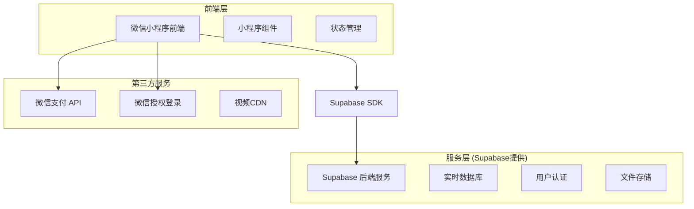
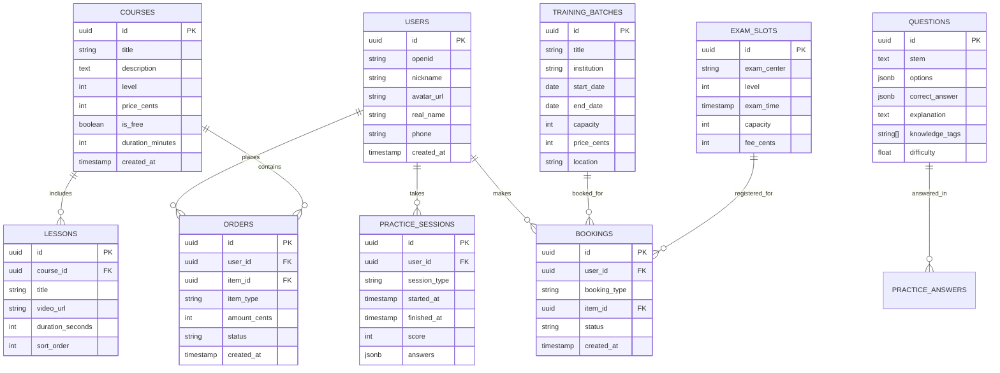

# 易飞行技术架构文档

## 1. 架构设计



## 2. 技术描述

* **前端**: 微信小程序原生开发 + Supabase JavaScript SDK

* **后端**: Supabase (PostgreSQL + 实时API + 认证服务)

* **存储**: Supabase Storage (课程视频、用户头像等)

* **支付**: 微信支付 API

* **CDN**: 腾讯云或阿里云 (视频加速)

## 3. 路由定义

| 路由路径                        | 页面用途             |
| --------------------------- | ---------------- |
| /pages/index/index          | 首页，展示学习路径和快速入口   |
| /pages/study/list           | 学习中心，课程列表和分类     |
| /pages/study/detail         | 课程详情页，课程介绍和购买    |
| /pages/study/video          | 视频播放页，支持进度记录和笔记  |
| /pages/practice/list        | 练习中心，章节练习和模拟考试入口 |
| /pages/practice/exam        | 考试页面，答题和计时功能     |
| /pages/practice/result      | 考试结果页，成绩分析和错题回顾  |
| /pages/practice/mistakes    | 错题本，错题管理和重做      |
| /pages/booking/training     | 培训预约，机构选择和时间预约   |
| /pages/booking/exam         | 考试预约，考点选择和报名     |
| /pages/profile/index        | 个人中心，用户信息和功能入口   |
| /pages/profile/orders       | 订单管理，购买记录和退款     |
| /pages/profile/certificates | 证书管理，培训证书和考试成绩   |
| /pages/profile/reports      | 学习报告，数据分析和进度跟踪   |

## 4. API定义

### 4.1 核心API

**用户认证相关**

```
POST /auth/login
```

请求参数:

| 参数名      | 参数类型   | 是否必需 | 描述     |
| -------- | ------ | ---- | ------ |
| code     | string | true | 微信登录凭证 |
| userInfo | object | true | 微信用户信息 |

响应参数:

| 参数名   | 参数类型   | 描述     |
| ----- | ------ | ------ |
| token | string | 用户访问令牌 |
| user  | object | 用户基本信息 |

**课程相关**

```
GET /api/courses
GET /api/courses/{id}
POST /api/courses/{id}/purchase
```

**练习相关**

```
GET /api/questions
POST /api/practice/start
POST /api/practice/submit
GET /api/practice/mistakes
```

**预约相关**

```
GET /api/trainings
POST /api/trainings/{id}/book
GET /api/exams/slots
POST /api/exams/{id}/register
```

示例请求:

```json
{
  "course_id": "uuid-string",
  "payment_method": "wechat_pay"
}
```

## 5. 数据模型

### 5.1 数据模型定义



### 5.2 数据定义语言

**用户表 (users)**

```sql
-- 创建用户表
CREATE TABLE users (
    id UUID PRIMARY KEY DEFAULT gen_random_uuid(),
    openid VARCHAR(100) UNIQUE NOT NULL,
    nickname VARCHAR(100),
    avatar_url TEXT,
    real_name VARCHAR(50),
    phone VARCHAR(20),
    level INTEGER DEFAULT 1,
    created_at TIMESTAMP WITH TIME ZONE DEFAULT NOW(),
    updated_at TIMESTAMP WITH TIME ZONE DEFAULT NOW()
);

-- 创建索引
CREATE INDEX idx_users_openid ON users(openid);
CREATE INDEX idx_users_phone ON users(phone);

-- 权限设置
GRANT SELECT ON users TO anon;
GRANT ALL PRIVILEGES ON users TO authenticated;
```

**课程表 (courses)**

```sql
-- 创建课程表
CREATE TABLE courses (
    id UUID PRIMARY KEY DEFAULT gen_random_uuid(),
    title VARCHAR(200) NOT NULL,
    description TEXT,
    cover_image TEXT,
    level INTEGER NOT NULL CHECK (level IN (1, 2, 3)), -- 1:VLOS, 2:BVLOS, 3:教员
    price_cents INTEGER DEFAULT 0,
    is_free BOOLEAN DEFAULT true,
    duration_minutes INTEGER DEFAULT 0,
    lesson_count INTEGER DEFAULT 0,
    rating DECIMAL(3,2) DEFAULT 0,
    student_count INTEGER DEFAULT 0,
    status INTEGER DEFAULT 1, -- 1:上架, 0:下架
    created_at TIMESTAMP WITH TIME ZONE DEFAULT NOW()
);

-- 创建索引
CREATE INDEX idx_courses_level ON courses(level);
CREATE INDEX idx_courses_is_free ON courses(is_free);
CREATE INDEX idx_courses_status ON courses(status);

-- 权限设置
GRANT SELECT ON courses TO anon;
GRANT ALL PRIVILEGES ON courses TO authenticated;
```

**题目表 (questions)**

```sql
-- 创建题目表
CREATE TABLE questions (
    id UUID PRIMARY KEY DEFAULT gen_random_uuid(),
    stem TEXT NOT NULL,
    question_type INTEGER NOT NULL, -- 1:单选, 2:多选, 3:判断
    options JSONB, -- 选项数组
    correct_answer JSONB NOT NULL, -- 正确答案
    explanation TEXT,
    knowledge_tags TEXT[], -- 知识点标签
    difficulty DECIMAL(3,2) DEFAULT 0.5, -- 难度系数 0-1
    level INTEGER NOT NULL, -- 适用等级
    created_at TIMESTAMP WITH TIME ZONE DEFAULT NOW()
);

-- 创建索引
CREATE INDEX idx_questions_level ON questions(level);
CREATE INDEX idx_questions_difficulty ON questions(difficulty);
CREATE INDEX idx_questions_knowledge_tags ON questions USING GIN(knowledge_tags);

-- 权限设置
GRANT SELECT ON questions TO anon;
GRANT ALL PRIVILEGES ON questions TO authenticated;
```

**练习记录表 (practice\_sessions)**

```sql
-- 创建练习记录表
CREATE TABLE practice_sessions (
    id UUID PRIMARY KEY DEFAULT gen_random_uuid(),
    user_id UUID REFERENCES users(id) ON DELETE CASCADE,
    session_type VARCHAR(50) NOT NULL, -- 'chapter', 'mock_exam', 'mistakes'
    question_ids UUID[],
    answers JSONB,
    score INTEGER DEFAULT 0,
    total_questions INTEGER DEFAULT 0,
    correct_count INTEGER DEFAULT 0,
    started_at TIMESTAMP WITH TIME ZONE DEFAULT NOW(),
    finished_at TIMESTAMP WITH TIME ZONE,
    duration_seconds INTEGER
);

-- 创建索引
CREATE INDEX idx_practice_sessions_user_id ON practice_sessions(user_id);
CREATE INDEX idx_practice_sessions_type ON practice_sessions(session_type);
CREATE INDEX idx_practice_sessions_started_at ON practice_sessions(started_at DESC);

-- 权限设置
GRANT ALL PRIVILEGES ON practice_sessions TO authenticated;
```

**初始化数据**

```sql
-- 插入示例课程数据
INSERT INTO courses (title, description, level, is_free, duration_minutes) VALUES
('无人机基础理论', '无人机飞行原理、法规基础知识', 1, true, 120),
('VLOS视距内飞行', 'VLOS执照考试专项课程', 1, false, 300),
('BVLOS超视距飞行', 'BVLOS执照考试专项课程', 2, false, 480);

-- 插入示例题目数据
INSERT INTO questions (stem, question_type, options, correct_answer, explanation, level) VALUES
('无人机的升力主要来源于？', 1, 
 '["螺旋桨旋转", "机身重量", "空气动力学原理", "电机功率"]',
 '[2]', '根据空气动力学原理，螺旋桨旋转产生向下的气流，根据牛顿第三定律产生向上的升力。', 1);
```

