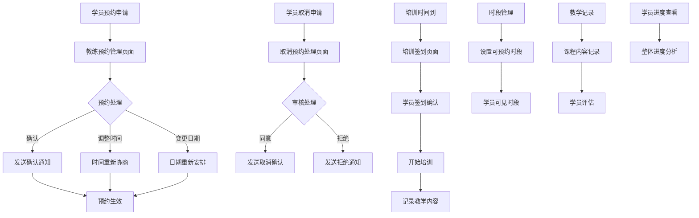

# 易飞行教练端产品需求文档

## 1. 产品概述

易飞行教练端是专为飞行培训教练设计的移动端管理平台，主要用于处理学员预约管理、培训签到确认、教学记录管理和学员学习进度跟踪等核心业务。系统通过数字化手段提升教练工作效率，优化培训管理流程，确保培训质量和学员体验。

## 2. 核心功能模块

### 2.1 用户角色

| 角色      | 注册方式    | 核心权限                |
| ------- | ------- | ------------------- |
| 飞行教练    | 机构邀请码注册 | 预约管理、签到确认、教学记录、进度查看 |
| 培训机构管理员 | 系统后台分配  | 教练管理、课程设置、数据统计      |

### 2.2 功能模块概述

教练端系统包含以下6个核心页面：

1. **预约管理页面**：学员预约确认、时间调整、变更处理
2. **取消预约处理页面**：预约取消问题处理、学员提醒
3. **培训签到页面**：现场签到确认、出勤管理
4. **时段管理页面**：可预约时段设置、时间表管理
5. **教学记录页面**：培训记录管理、课程情况记录
6. **学员进度页面**：学员学习进度查看、整体进度分析

### 2.3 页面详细功能

| 页面名称     | 模块名称   | 功能描述                                     |
| -------- | ------ | ---------------------------------------- |
| 预约管理页面   | 预约列表   | 显示待处理预约、支持确认/调整/变更操作，包含学员信息、预约时间、课程类型等字段 |
| 预约管理页面   | 预约详情   | 查看预约详细信息，支持备注添加、状态更新、时间重新安排              |
| 预约管理页面   | 操作记录   | 记录所有预约变更历史，包含操作时间、操作类型、操作人员              |
| 取消预约处理页面 | 取消申请列表 | 显示学员取消预约申请，支持审核通过/拒绝，自动发送提醒通知            |
| 取消预约处理页面 | 提醒管理   | 设置自动提醒规则，管理提醒模板，查看提醒发送记录                 |
| 培训签到页面   | 签到确认   | 扫码或手动确认学员到场，记录实际参与人员，支持迟到/早退标记           |
| 培训签到页面   | 出勤统计   | 统计课程出勤率，生成出勤报表，标记缺勤学员                    |
| 时段管理页面   | 时间表设置  | 设置可预约时段，支持批量操作，设置特殊时段规则                  |
| 时段管理页面   | 时段状态管理 | 管理时段开放/关闭状态，设置容量限制，查看预约情况                |
| 教学记录页面   | 课程记录   | 记录每次培训内容、学员表现、教学重点，支持图片/视频上传             |
| 教学记录页面   | 评估管理   | 对学员进行阶段性评估，记录技能掌握情况，生成评估报告               |
| 学员进度页面   | 进度概览   | 查看所有学员整体学习进度，支持按课程类型、时间段筛选               |
| 学员进度页面   | 个人进度详情 | 查看单个学员详细学习轨迹，包含课时完成情况、技能掌握度              |

## 3. 核心业务流程

### 3.1 教练端主要操作流程

**预约确认流程：**
学员提交预约 → 教练收到预约通知 → 教练确认/调整/变更预约 → 系统发送确认通知给学员 → 预约生效

**培训签到流程：**
培训开始前30分钟 → 教练打开签到页面 → 学员到场扫码/手动签到 → 教练确认出勤 → 开始培训 → 记录培训内容

**取消预约处理流程：**
学员申请取消 → 教练收到取消申请 → 教练审核申请 → 发送处理结果通知 → 更新时段状态



## 4. 数据字段设计

### 4.1 预约管理相关字段

**预约记录表 (booking\_records)**

```
- booking_id: 预约ID (主键)
- student_id: 学员ID
- coach_id: 教练ID
- course_type: 课程类型 (理论/实操/模拟器)
- booking_date: 预约日期
- booking_time_start: 开始时间
- booking_time_end: 结束时间
- status: 预约状态 (pending/confirmed/cancelled/completed)
- student_name: 学员姓名
- student_phone: 学员电话
- course_subject: 课程科目
- location: 培训地点
- notes: 备注信息
- created_at: 创建时间
- updated_at: 更新时间
- confirmed_at: 确认时间
- cancelled_reason: 取消原因
```

**预约操作记录表 (booking\_operations)**

```
- operation_id: 操作ID (主键)
- booking_id: 预约ID (外键)
- operation_type: 操作类型 (confirm/reschedule/cancel/modify)
- operator_id: 操作人ID
- operator_type: 操作人类型 (coach/student/admin)
- old_value: 原始值
- new_value: 新值
- operation_time: 操作时间
- operation_notes: 操作备注
```

### 4.2 签到管理相关字段

**签到记录表 (attendance\_records)**

```
- attendance_id: 签到ID (主键)
- booking_id: 预约ID (外键)
- student_id: 学员ID
- coach_id: 教练ID
- check_in_time: 签到时间
- check_out_time: 签退时间
- attendance_status: 出勤状态 (present/late/absent/early_leave)
- actual_duration: 实际培训时长 (分钟)
- location_verified: 位置验证 (boolean)
- check_in_method: 签到方式 (qr_code/manual/nfc)
- notes: 签到备注
```

### 4.3 时段管理相关字段

**可预约时段表 (available\_slots)**

```
- slot_id: 时段ID (主键)
- coach_id: 教练ID
- date: 日期
- start_time: 开始时间
- end_time: 结束时间
- max_capacity: 最大容量
- current_bookings: 当前预约数
- slot_type: 时段类型 (regular/special/maintenance)
- status: 时段状态 (available/full/closed/maintenance)
- course_types_allowed: 允许的课程类型 (JSON数组)
- location: 培训地点
- equipment_required: 所需设备
- special_requirements: 特殊要求
- created_at: 创建时间
- updated_at: 更新时间
```

### 4.4 教学记录相关字段

**教学记录表 (teaching\_records)**

```
- record_id: 记录ID (主键)
- booking_id: 预约ID (外键)
- coach_id: 教练ID
- student_id: 学员ID
- course_date: 上课日期
- course_duration: 课程时长 (分钟)
- course_content: 课程内容 (JSON)
- teaching_objectives: 教学目标
- student_performance: 学员表现评价
- skills_practiced: 练习技能 (JSON数组)
- difficulties_encountered: 遇到困难
- next_focus_areas: 下次重点关注
- overall_rating: 整体评分 (1-10)
- media_attachments: 媒体附件 (JSON数组)
- weather_conditions: 天气条件 (实操课程)
- equipment_used: 使用设备
- safety_incidents: 安全事件记录
- homework_assigned: 布置作业
- created_at: 创建时间
```

**学员评估表 (student\_assessments)**

```
- assessment_id: 评估ID (主键)
- student_id: 学员ID
- coach_id: 教练ID
- assessment_date: 评估日期
- assessment_type: 评估类型 (weekly/monthly/phase/final)
- course_type: 课程类型
- skill_categories: 技能分类评分 (JSON)
- theoretical_knowledge: 理论知识掌握度 (1-100)
- practical_skills: 实操技能水平 (1-100)
- safety_awareness: 安全意识 (1-100)
- learning_attitude: 学习态度 (1-100)
- progress_rate: 进度完成率 (%)
- strengths: 优势描述
- areas_for_improvement: 需改进方面
- recommendations: 建议
- next_milestone: 下一阶段目标
```

### 4.5 学员进度相关字段

**学员进度表 (student\_progress)**

```
- progress_id: 进度ID (主键)
- student_id: 学员ID
- course_type: 课程类型
- total_required_hours: 总需求学时
- completed_hours: 已完成学时
- remaining_hours: 剩余学时
- progress_percentage: 进度百分比
- current_phase: 当前阶段
- phase_completion: 阶段完成情况 (JSON)
- skill_mastery: 技能掌握情况 (JSON)
- exam_scores: 考试成绩记录 (JSON数组)
- practical_flight_hours: 实飞小时数
- simulator_hours: 模拟器小时数
- ground_school_hours: 地面理论小时数
- last_training_date: 最后培训日期
- next_scheduled_date: 下次计划日期
- estimated_completion_date: 预计完成日期
- status: 进度状态 (active/suspended/completed/dropped)
- updated_at: 更新时间
```

### 4.6 理论学习进度逻辑说明

#### 4.6.1 进度计算方式

**基础计算公式：**

```
理论学习进度(%) = 已掌握题目数量 / 总题目数量 × 100
```

**题目覆盖率计算原理：**

理论学习进度基于题目覆盖率进行计算，统计学员接触并掌握的题目数量占总题目库的比例。所有题目类型（顺序练习、模拟考试、真题、错题本）统一按覆盖率计算，不再使用权重分配。

**题目掌握标准：**

1. **掌握定义**：每道题目需要连续3次以上回答正确才算真正掌握

2. **覆盖统计**：

   * 顺序练习题目：按章节练习中的题目统计

   * 模拟考试题目：模拟考试中出现的题目统计

   * 真题练习题目：历年真题中的题目统计

   * 错题本题目：学员答错后加入错题本的题目统计

3. **去重处理**：同一道题目在不同场景出现时只计算一次，避免重复统计

**详细计算逻辑：**

1. **题目库统计**：

   * 系统维护完整的题目库，包含所有可能出现的题目

   * 每道题目具有唯一标识，支持跨场景识别

   * 题目总数 = 所有不重复题目的数量

2. **掌握判定**：

   * 学员首次接触题目时记录为"已接触"

   * 连续3次回答正确后标记为"已掌握"

   * 中间答错则重置连续正确计数

3. **进度更新**：

   * 实时统计已掌握题目数量

   * 动态计算覆盖率百分比

   * 每次答题后立即更新进度

#### 4.6.2 进度显示规则

**颜色编码系统：**

* **绿色 (≥80%)**：`bg-green-500` - 进度优秀，按计划推进

* **蓝色 (60%-79%)**：`bg-blue-500` - 进度良好，正常推进

* **黄色 (40%-59%)**：`bg-yellow-500` - 进度一般，需要关注

* **红色 (<40%)**：`bg-red-500` - 进度滞后，需要干预

**显示格式：**

* 百分比数值显示：保留整数，如"75%"

* 进度条可视化：使用CSS宽度属性动态显示

* 状态文字描述：配合颜色显示进度状态

#### 4.6.3 进度更新机制

**实时更新触发条件：**

1. **学习活动完成触发**：

   * 学员完成顺序练习时立即更新进度

   * 完成模拟考试时重新计算进度

   * 完成真题练习时确认进度提升

   * 完成错题复习时更新掌握状态

2. **数据同步流程**：

   ```
   学员操作 → 前端记录 → API调用 → 后端计算 → 数据库更新 → 实时推送 → 教练端显示
   ```

3. **批量更新机制**：

   * 每日凌晨2点执行批量进度校验

   * 修正异常数据和计算偏差

   * 重新计算错题本状态

   * 生成进度变化日志

#### 4.6.4 计算示例说明

**假设学员张三的学习数据如下：**

* 题目库总数：500道题目

* 已接触题目：320道题目

* 已掌握题目：240道题目（连续3次答对）

**详细计算过程：**

1. **题目掌握情况统计**

   * 顺序练习：接触80道，掌握65道

   * 模拟考试：接触120道，掌握90道

   * 真题练习：接触100道，掌握75道

   * 错题本复习：接触20道，掌握10道

   * 去重后实际掌握：240道（部分题目在多个场景重复出现）

2. **覆盖率计算**

   * 题目覆盖率 = 已掌握题目数量 / 总题目数量

   * 题目覆盖率 = 240 / 500 = 48%

3. **最终进度结果**

   * 理论学习进度：48%

**显示结果：**

* 进度百分比：48%

* 颜色等级：黄色（40%-59%区间）

* 状态描述：进度一般，需要关注

**教练端显示效果：**

```
张三 (ID: 2024001)
理论学习进度: 48% [黄色进度条]
题目掌握: 240/500道
```

**进度提升建议：**

* 重点关注未掌握的260道题目

* 加强错题复习，提高掌握稳定性

* 建议每日练习20-30道新题目

#### 4.6.4 教练端展示方式

**学员进度管理页面展示：**

1. **列表视图**：

   * 学员姓名 + 进度条 + 百分比数值

   * 颜色编码快速识别进度状态

   * 支持按进度范围筛选学员

## 5. 交互逻辑设计

### 5.1 预约管理交互逻辑

**预约确认操作：**

1. 教练登录系统，进入预约管理页面
2. 系统显示待处理预约列表，按时间排序
3. 教练点击预约项目，查看详细信息
4. 教练可选择：确认、调整时间、变更日期、添加备注
5. 确认操作后，系统自动发送通知给学员
6. 预约状态更新，记录操作日志

**时间调整流程：**

1. 教练选择"调整时间"选项
2. 系统显示教练可用时段
3. 教练选择新的时间段
4. 系统检查时段冲突和容量限制
5. 发送调整通知给学员，等待学员确认
6. 学员确认后更新预约信息

### 5.2 签到管理交互逻辑

**签到确认流程：**

1. 培训开始前30分钟，系统推送签到提醒
2. 教练打开签到页面，显示当前时段预约学员
3. 学员到场后扫描二维码或教练手动确认
4. 系统记录签到时间和位置信息
5. 显示实际到场学员列表
6. 培训结束后记录签退时间

**缺勤处理：**

1. 超过开始时间15分钟未签到标记为迟到
2. 超过30分钟标记为缺勤
3. 系统自动发送缺勤通知
4. 教练可添加缺勤原因备注
5. 触发补课或退费流程

### 5.3 教学记录交互逻辑

**记录创建流程：**

1. 培训结束后，教练进入教学记录页面
2. 系统自动关联当前培训预约信息
3. 教练填写课程内容、学员表现等信息
4. 支持上传图片、视频等媒体文件
5. 保存记录后自动同步到学员进度
6. 生成培训报告发送给学员

**评估记录：**

1. 定期评估提醒（每周/每月）
2. 教练填写技能评估表
3. 系统计算综合评分
4. 生成进度报告和改进建议
5. 更新学员整体进度状态

### 5.4 进度查看交互逻辑

**进度概览：**

1. 教练进入学员进度页面
2. 显示所有负责学员的进度概览
3. 支持按课程类型、进度状态筛选
4. 点击学员查看详细进度信息
5. 支持导出进度报告

**详细进度分析：**

1. 显示学员完整学习轨迹
2. 图表展示进度趋势
3. 标注关键节点和里程碑
4. 显示预计完成时间
5. 提供进度优化建议

## 6. 业务规则

### 6.1 预约管理规则

* 预约确认时限：教练需在24小时内处理预约申请

* 时间调整限制：培训前48小时内不允许调整时间

* 容量限制：每个时段最多容纳设定数量的学员

* 冲突检测：系统自动检测时间冲突并提醒

### 6.2 签到管理规则

* 签到时间窗口：培训开始前30分钟至开始后15分钟

* 迟到标准：超过开始时间15分钟为迟到

* 缺勤标准：超过开始时间30分钟为缺勤

* 位置验证：实操课程需要位置验证

### 6.3 教学记录规则

* 记录完整性：每次培训必须有对应教学记录

* 记录时限：培训结束后24小时内完成记录

* 媒体文件：单个文件不超过50MB，总容量不超过200MB

* 评估频率：理论课程每周评估，实操课程每次评估

### 6.4 进度管理规则

* 进度更新：每次培训后自动更新进度

* 阶段晋级：需要通过阶段考核才能进入下一阶段

* 暂停条件：连续缺勤3次自动暂停培训

* 完成标准：达到规定学时且通过最终考核

## 7. 用户界面设计

### 7.1 设计风格

* **主色调**：专业蓝色 (#2563EB) 和辅助绿色 (#059669)

* **按钮样式**：圆角矩形，渐变效果，悬停状态变化

* **字体**：系统默认字体，标题16px，正文14px，备注12px

* **布局风格**：卡片式布局，顶部导航，左侧功能菜单

* **图标风格**：线性图标，统一风格，支持主题色彩

### 7.2 页面设计概览

| 页面名称   | 模块名称 | UI元素                     |
| ------ | ---- | ------------------------ |
| 预约管理页面 | 预约列表 | 卡片式列表，状态标签，操作按钮组，筛选器，搜索框 |
| 预约管理页面 | 预约详情 | 模态框，表单输入，时间选择器，备注文本框     |
| 签到管理页面 | 签到列表 | 学员头像，签到状态图标，时间显示，操作按钮    |
| 签到管理页面 | 扫码签到 | 二维码扫描器，手动输入框，确认按钮        |
| 时段管理页面 | 时间表  | 日历组件，时段网格，容量指示器，状态颜色编码   |
| 时段管理页面 | 时段设置 | 时间选择器，容量输入，课程类型选择，保存按钮   |
| 教学记录页面 | 记录表单 | 富文本编辑器，文件上传，评分滑块，保存按钮    |
| 教学记录页面 | 记录列表 | 时间轴布局，记录卡片，搜索筛选，导出按钮     |
| 学员进度页面 | 进度概览 | 进度条，百分比显示，状态标签，筛选选项      |
| 学员进度页面 | 详细进度 | 图表组件，里程碑标记，技能雷达图，建议面板    |

### 7.3 响应式设计

* **桌面优先**：主要面向桌面端使用，1200px以上最佳体验

* **平板适配**：768px-1199px屏幕适配，调整布局和字体大小

* **移动端支持**：基础功能支持移动端访问，签到功能优化触屏操作

## 8. 技术实现要求

### 8.1 性能要求

* 页面加载时间：首屏加载不超过3秒

* 数据查询响应：列表查询不超过1秒

* 文件上传：支持断点续传，进度显示

* 并发处理：支持100个教练同时在线操作

### 8.2 安全要求

* 身份认证：JWT令牌认证，2小时过期

* 权限控制：基于角色的访问控制(RBAC)

* 数据加密：敏感数据AES-256加密存储

* 操作日志：所有关键操作记录审计日志

### 8.3 数据同步

* 实时同步：预约状态变更实时推送

* 离线支持：签到功能支持离线操作，网络恢复后同步

* 数据备份：每日自动备份，保留30天历史数据

* 冲突解决：多端操作冲突时以服务端时间戳为准

### 8.4 集成要求

* 消息推送：集成短信和邮件通知服务

* 文件存储：集成云存储服务，支持CDN加速

* 支付接口：集成支付宝、微信支付（退费场景）

* 第三方日历：支持同步到Google日历、Outlook

## 9. 数据统计与报表

### 9.1 教练工作统计

* 每日/周/月培训时长统计

* 学员签到率统计

* 教学质量评分趋势

* 预约确认及时率

### 9.2 学员进度报表

* 整体进度完成情况

* 各阶段用时分析

* 技能掌握度对比

* 考试通过率统计

### 9.3 运营数据分析

* 时段利用率分析

* 取消预约原因统计

* 设备使用频率统计

* 培训成本效益分析

## 10. 系统维护与支持

### 10.1 日常维护

* 数据库定期优化和清理

* 系统性能监控和告警

* 用户反馈收集和处理

* 功能使用情况分析

### 10.2 版本更新

* 月度功能更新和优化

* 安全补丁及时推送

* 用户培训和操作指导

* 新功能灰度发布测试

### 10.3 技术支持

* 7×24小时技术支持热线

* 在线帮助文档和视频教程

* 远程协助和问题诊断

* 定期用户满意度调研

