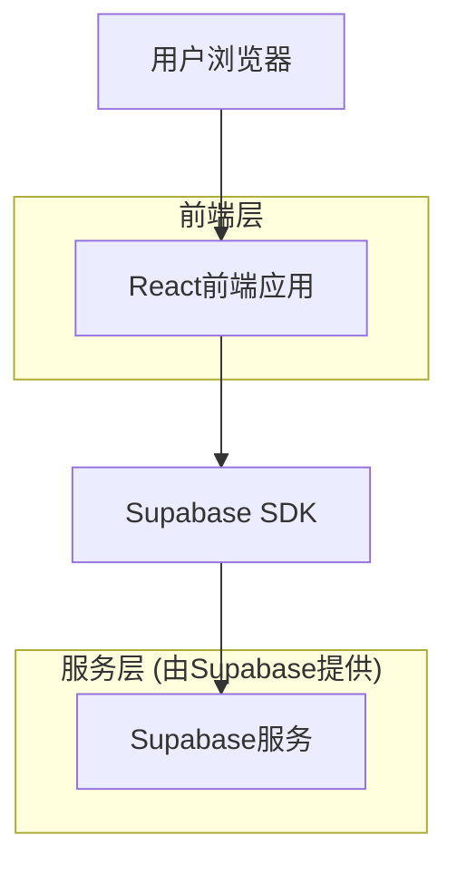
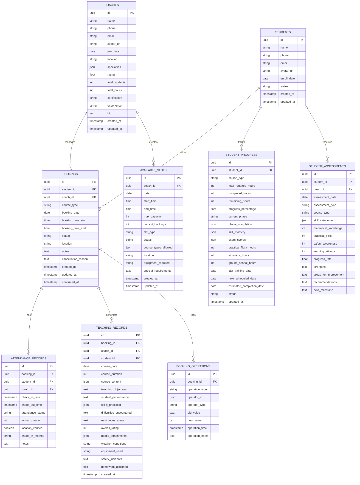

# 易飞行教练端技术架构文档

## 1. 架构设计



## 2. 技术描述

* 前端：React\@18 + TypeScript + Tailwind CSS\@3 + Vite + React Router DOM

* 后端：Supabase (提供认证、数据库、实时订阅功能)

* 状态管理：React Hooks (useState, useEffect)

* UI组件：Lucide React (图标库)

* 构建工具：Vite

## 3. 路由定义

| 路由                   | 用途                  |
| -------------------- | ------------------- |
| /coach               | 教练端首页，显示工作台概览和快捷操作  |
| /coach/login         | 教练登录页面，支持手机号密码登录和注册 |
| /coach/bookings      | 预约管理页面，处理学员预约确认和调整  |
| /coach/bookings/:id  | 预约详情页面，查看和编辑具体预约信息  |
| /coach/cancellations | 取消预约处理页面，审核学员取消申请   |
| /coach/checkin       | 培训签到页面，支持扫码和手动签到    |
| /coach/schedule      | 时段管理页面，设置和管理可预约时段   |
| /coach/records       | 教学记录页面，记录和管理培训内容    |
| /coach/progress      | 学员进度页面，查看学员学习进度     |
| /coach/profile       | 教练个人中心，管理个人信息和设置    |

## 4. 数据模型

### 4.1 数据模型定义



### 4.2 数据定义语言

**教练表 (coaches)**

```sql
-- 创建教练表
CREATE TABLE coaches (
    id UUID PRIMARY KEY DEFAULT gen_random_uuid(),
    name VARCHAR(100) NOT NULL,
    phone VARCHAR(20) UNIQUE NOT NULL,
    email VARCHAR(255) UNIQUE,
    avatar_url TEXT,
    join_date DATE DEFAULT CURRENT_DATE,
    location VARCHAR(255),
    specialties JSONB DEFAULT '[]',
    rating DECIMAL(2,1) DEFAULT 5.0,
    total_students INTEGER DEFAULT 0,
    total_hours INTEGER DEFAULT 0,
    certification VARCHAR(255),
    experience TEXT,
    bio TEXT,
    created_at TIMESTAMP WITH TIME ZONE DEFAULT NOW(),
    updated_at TIMESTAMP WITH TIME ZONE DEFAULT NOW()
);

-- 创建索引
CREATE INDEX idx_coaches_phone ON coaches(phone);
CREATE INDEX idx_coaches_email ON coaches(email);

-- 设置权限
GRANT SELECT ON coaches TO anon;
GRANT ALL PRIVILEGES ON coaches TO authenticated;
```

**学员表 (students)**

```sql
-- 创建学员表
CREATE TABLE students (
    id UUID PRIMARY KEY DEFAULT gen_random_uuid(),
    name VARCHAR(100) NOT NULL,
    phone VARCHAR(20) UNIQUE NOT NULL,
    email VARCHAR(255),
    avatar_url TEXT,
    enroll_date DATE DEFAULT CURRENT_DATE,
    status VARCHAR(20) DEFAULT 'active' CHECK (status IN ('active', 'suspended', 'completed', 'dropped')),
    created_at TIMESTAMP WITH TIME ZONE DEFAULT NOW(),
    updated_at TIMESTAMP WITH TIME ZONE DEFAULT NOW()
);

-- 创建索引
CREATE INDEX idx_students_phone ON students(phone);
CREATE INDEX idx_students_status ON students(status);

-- 设置权限
GRANT SELECT ON students TO anon;
GRANT ALL PRIVILEGES ON students TO authenticated;
```

**预约表 (bookings)**

```sql
-- 创建预约表
CREATE TABLE bookings (
    id UUID PRIMARY KEY DEFAULT gen_random_uuid(),
    student_id UUID REFERENCES students(id),
    coach_id UUID REFERENCES coaches(id),
    course_type VARCHAR(50) NOT NULL,
    booking_date DATE NOT NULL,
    booking_time_start TIME NOT NULL,
    booking_time_end TIME NOT NULL,
    status VARCHAR(20) DEFAULT 'pending' CHECK (status IN ('pending', 'confirmed', 'cancelled', 'completed')),
    location VARCHAR(255),
    notes TEXT,
    cancellation_reason TEXT,
    created_at TIMESTAMP WITH TIME ZONE DEFAULT NOW(),
    updated_at TIMESTAMP WITH TIME ZONE DEFAULT NOW(),
    confirmed_at TIMESTAMP WITH TIME ZONE
);

-- 创建索引
CREATE INDEX idx_bookings_student_id ON bookings(student_id);
CREATE INDEX idx_bookings_coach_id ON bookings(coach_id);
CREATE INDEX idx_bookings_date ON bookings(booking_date);
CREATE INDEX idx_bookings_status ON bookings(status);

-- 设置权限
GRANT SELECT ON bookings TO anon;
GRANT ALL PRIVILEGES ON bookings TO authenticated;
```

**签到记录表 (attendance\_records)**

```sql
-- 创建签到记录表
CREATE TABLE attendance_records (
    id UUID PRIMARY KEY DEFAULT gen_random_uuid(),
    booking_id UUID REFERENCES bookings(id),
    student_id UUID REFERENCES students(id),
    coach_id UUID REFERENCES coaches(id),
    check_in_time TIMESTAMP WITH TIME ZONE,
    check_out_time TIMESTAMP WITH TIME ZONE,
    attendance_status VARCHAR(20) DEFAULT 'present' CHECK (attendance_status IN ('present', 'late', 'absent', 'early_leave')),
    actual_duration INTEGER, -- 实际培训时长(分钟)
    location_verified BOOLEAN DEFAULT false,
    check_in_method VARCHAR(20) DEFAULT 'manual' CHECK (check_in_method IN ('qr_code', 'manual', 'nfc')),
    notes TEXT
);

-- 创建索引
CREATE INDEX idx_attendance_booking_id ON attendance_records(booking_id);
CREATE INDEX idx_attendance_student_id ON attendance_records(student_id);
CREATE INDEX idx_attendance_coach_id ON attendance_records(coach_id);

-- 设置权限
GRANT SELECT ON attendance_records TO anon;
GRANT ALL PRIVILEGES ON attendance_records TO authenticated;
```

**可预约时段表 (available\_slots)**

```sql
-- 创建可预约时段表
CREATE TABLE available_slots (
    id UUID PRIMARY KEY DEFAULT gen_random_uuid(),
    coach_id UUID REFERENCES coaches(id),
    date DATE NOT NULL,
    start_time TIME NOT NULL,
    end_time TIME NOT NULL,
    max_capacity INTEGER DEFAULT 1,
    current_bookings INTEGER DEFAULT 0,
    slot_type VARCHAR(20) DEFAULT 'regular' CHECK (slot_type IN ('regular', 'special', 'maintenance')),
    status VARCHAR(20) DEFAULT 'available' CHECK (status IN ('available', 'full', 'closed', 'maintenance')),
    course_types_allowed JSONB DEFAULT '["理论培训", "实操培训", "模拟考试"]',
    location VARCHAR(255),
    equipment_required VARCHAR(255),
    special_requirements TEXT,
    created_at TIMESTAMP WITH TIME ZONE DEFAULT NOW(),
    updated_at TIMESTAMP WITH TIME ZONE DEFAULT NOW()
);

-- 创建索引
CREATE INDEX idx_slots_coach_id ON available_slots(coach_id);
CREATE INDEX idx_slots_date ON available_slots(date);
CREATE INDEX idx_slots_status ON available_slots(status);

-- 设置权限
GRANT SELECT ON available_slots TO anon;
GRANT ALL PRIVILEGES ON available_slots TO authenticated;
```

**教学记录表 (teaching\_records)**

```sql
-- 创建教学记录表
CREATE TABLE teaching_records (
    id UUID PRIMARY KEY DEFAULT gen_random_uuid(),
    booking_id UUID REFERENCES bookings(id),
    coach_id UUID REFERENCES coaches(id),
    student_id UUID REFERENCES students(id),
    course_date DATE NOT NULL,
    course_duration INTEGER, -- 课程时长(分钟)
    course_content JSONB,
    teaching_objectives TEXT,
    student_performance TEXT,
    skills_practiced JSONB DEFAULT '[]',
    difficulties_encountered TEXT,
    next_focus_areas TEXT,
    overall_rating INTEGER CHECK (overall_rating >= 1 AND overall_rating <= 10),
    media_attachments JSONB DEFAULT '[]',
    weather_conditions VARCHAR(100),
    equipment_used VARCHAR(255),
    safety_incidents TEXT,
    homework_assigned TEXT,
    created_at TIMESTAMP WITH TIME ZONE DEFAULT NOW()
);

-- 创建索引
CREATE INDEX idx_teaching_records_booking_id ON teaching_records(booking_id);
CREATE INDEX idx_teaching_records_coach_id ON teaching_records(coach_id);
CREATE INDEX idx_teaching_records_student_id ON teaching_records(student_id);
CREATE INDEX idx_teaching_records_date ON teaching_records(course_date);

-- 设置权限
GRANT SELECT ON teaching_records TO anon;
GRANT ALL PRIVILEGES ON teaching_records TO authenticated;
```

**学员进度表 (student\_progress)**

```sql
-- 创建学员进度表
CREATE TABLE student_progress (
    id UUID PRIMARY KEY DEFAULT gen_random_uuid(),
    student_id UUID REFERENCES students(id),
    course_type VARCHAR(50) NOT NULL,
    total_required_hours INTEGER DEFAULT 40,
    completed_hours INTEGER DEFAULT 0,
    remaining_hours INTEGER DEFAULT 40,
    progress_percentage DECIMAL(5,2) DEFAULT 0.00,
    current_phase VARCHAR(100),
    phase_completion JSONB DEFAULT '{}',
    skill_mastery JSONB DEFAULT '{}',
    exam_scores JSONB DEFAULT '[]',
    practical_flight_hours INTEGER DEFAULT 0,
    simulator_hours INTEGER DEFAULT 0,
    ground_school_hours INTEGER DEFAULT 0,
    last_training_date DATE,
    next_scheduled_date DATE,
    estimated_completion_date DATE,
    status VARCHAR(20) DEFAULT 'active' CHECK (status IN ('active', 'suspended', 'completed', 'dropped')),
    updated_at TIMESTAMP WITH TIME ZONE DEFAULT NOW()
);

-- 创建索引
CREATE INDEX idx_progress_student_id ON student_progress(student_id);
CREATE INDEX idx_progress_course_type ON student_progress(course_type);
CREATE INDEX idx_progress_status ON student_progress(status);

-- 设置权限
GRANT SELECT ON student_progress TO anon;
GRANT ALL PRIVILEGES ON student_progress TO authenticated;
```

**预约操作记录表 (booking\_operations)**

```sql
-- 创建预约操作记录表
CREATE TABLE booking_operations (
    id UUID PRIMARY KEY DEFAULT gen_random_uuid(),
    booking_id UUID REFERENCES bookings(id),
    operation_type VARCHAR(20) NOT NULL CHECK (operation_type IN ('confirm', 'reschedule', 'cancel', 'modify')),
    operator_id UUID NOT NULL,
    operator_type VARCHAR(20) NOT NULL CHECK (operator_type IN ('coach', 'student', 'admin')),
    old_value TEXT,
    new_value TEXT,
    operation_time TIMESTAMP WITH TIME ZONE DEFAULT NOW(),
    operation_notes TEXT
);

-- 创建索引
CREATE INDEX idx_operations_booking_id ON booking_operations(booking_id);
CREATE INDEX idx_operations_operator_id ON booking_operations(operator_id);
CREATE INDEX idx_operations_time ON booking_operations(operation_time);

-- 设置权限
GRANT SELECT ON booking_operations TO anon;
GRANT ALL PRIVILEGES ON booking_operations TO authenticated;
```

**学员评估表 (student\_assessments)**

```sql
-- 创建学员评估表
CREATE TABLE student_assessments (
    id UUID PRIMARY KEY DEFAULT gen_random_uuid(),
    student_id UUID REFERENCES students(id),
    coach_id UUID REFERENCES coaches(id),
    assessment_date DATE DEFAULT CURRENT_DATE,
    assessment_type VARCHAR(20) DEFAULT 'weekly' CHECK (assessment_type IN ('weekly', 'monthly', 'phase', 'final')),
    course_type VARCHAR(50) NOT NULL,
    skill_categories JSONB DEFAULT '{}',
    theoretical_knowledge INTEGER CHECK (theoretical_knowledge >= 0 AND theoretical_knowledge <= 100),
    practical_skills INTEGER CHECK (practical_skills >= 0 AND practical_skills <= 100),
    safety_awareness INTEGER CHECK (safety_awareness >= 0 AND safety_awareness <= 100),
    learning_attitude INTEGER CHECK (learning_attitude >= 0 AND learning_attitude <= 100),
    progress_rate DECIMAL(5,2),
    strengths TEXT,
    areas_for_improvement TEXT,
    recommendations TEXT,
    next_milestone TEXT
);

-- 创建索引
CREATE INDEX idx_assessments_student_id ON student_assessments(student_id);
CREATE INDEX idx_assessments_coach_id ON student_assessments(coach_id);
CREATE INDEX idx_assessments_date ON student_assessments(assessment_date);

-- 设置权限
GRANT SELECT ON student_assessments TO anon;
GRANT ALL PRIVILEGES ON student_assessments TO authenticated;
```

**初始化数据**

```sql
-- 插入示例教练数据
INSERT INTO coaches (name, phone, email, location, specialties, certification, experience, bio) VALUES
('王教练', '13888888888', 'coach.wang@example.com', '北京市朝阳区', '["理论培训", "实操训练", "考试辅导"]', 'AOPA无人机教员证', '5年无人机培训经验', '专业无人机培训教练，具有丰富的理论教学和实操指导经验。');

-- 插入示例学员数据
INSERT INTO students (name, phone, email) VALUES
('张三', '13812341234', 'zhangsan@example.com'),
('李四', '13956785678', 'lisi@example.com'),
('王五', '13790129012', 'wangwu@example.com');
```

