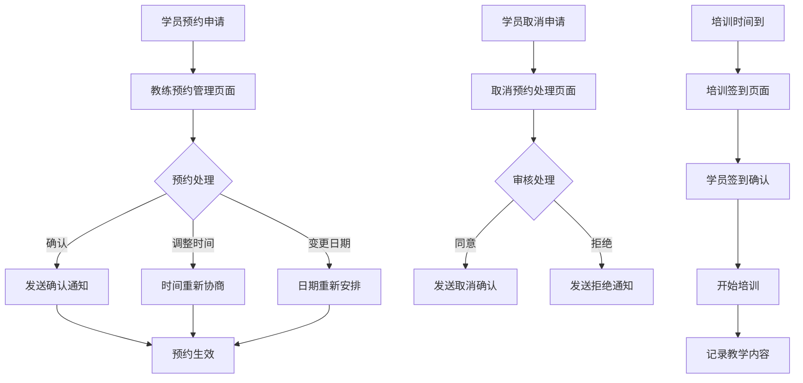

# 易飞行教练端移动应用产品需求文档

## 1. 产品概述

易飞行教练端移动应用是专为飞行培训教练设计的移动端管理平台，主要用于处理学员预约管理、培训签到确认、教学记录管理和学员学习进度跟踪等核心业务。系统采用移动优先的设计理念，通过简约直观的界面提升教练工作效率，优化培训管理流程。

## 2. 核心功能

### 2.1 用户角色

| 角色   | 注册方式    | 核心权限                |
| ---- | ------- | ------------------- |
| 飞行教练 | 机构邀请码注册 | 预约管理、签到确认、教学记录、进度查看 |

### 2.2 功能模块

教练端移动应用包含以下6个核心页面：

1. **预约管理页面**：学员预约确认、时间调整、变更处理
2. **取消预约处理页面**：预约取消问题处理、学员提醒
3. **培训签到页面**：现场签到确认、出勤管理
4. **时段管理页面**：可预约时段设置、时间表管理
5. **教学记录页面**：培训记录管理、课程情况记录
6. **学员进度页面**：学员学习进度查看、整体进度分析

### 2.3 页面详细功能

| 页面名称     | 模块名称   | 功能描述                                  |
| -------- | ------ | ------------------------------------- |
| 预约管理页面   | 预约列表   | 显示待处理预约，支持确认/调整/变更操作，包含学员信息、预约时间、课程类型 |
| 预约管理页面   | 预约详情   | 查看预约详细信息，支持备注添加、状态更新、时间重新安排           |
| 取消预约处理页面 | 取消申请列表 | 显示学员取消预约申请，支持审核通过/拒绝，自动发送提醒通知         |
| 培训签到页面   | 签到确认   | 扫码或手动确认学员到场，记录实际参与人员，支持迟到/早退标记        |
| 培训签到页面   | 出勤统计   | 统计课程出勤率，生成出勤报表，标记缺勤学员                 |
| 时段管理页面   | 时间表设置  | 设置可预约时段，支持批量操作，设置特殊时段规则               |
| 时段管理页面   | 时段状态管理 | 管理时段开放/关闭状态，设置容量限制，查看预约情况             |
| 教学记录页面   | 课程记录   | 记录每次培训内容、学员表现、教学重点，支持图片/视频上传          |
| 教学记录页面   | 评估管理   | 对学员进行阶段性评估，记录技能掌握情况，生成评估报告            |
| 学员进度页面   | 进度概览   | 查看所有学员整体学习进度，支持按课程类型、时间段筛选            |
| 学员进度页面   | 个人进度详情 | 查看单个学员详细学习轨迹，包含课时完成情况、技能掌握度           |

## 3. 核心流程

**预约确认流程：**
学员提交预约 → 教练收到预约通知 → 教练确认/调整/变更预约 → 系统发送确认通知给学员 → 预约生效

**培训签到流程：**
培训开始前30分钟 → 教练打开签到页面 → 学员到场扫码/手动签到 → 教练确认出勤 → 开始培训 → 记录培训内容

**取消预约处理流程：**
学员申请取消 → 教练收到取消申请 → 教练审核申请 → 发送处理结果通知 → 更新时段状态

## 4. 用户界面设计

### 4.1 设计风格

* **主色调**：专业蓝色 (#2563EB) 和辅助绿色 (#059669)

* **按钮样式**：圆角矩形，简洁扁平化设计，适合触摸操作

* **字体**：系统默认字体，标题18px，正文16px，备注14px

* **布局风格**：移动端卡片式布局，底部导航栏，顶部状态栏

* **图标风格**：线性图标，简约风格，支持主题色彩

### 4.2 页面设计概览

| 页面名称   | 模块名称 | UI元素                    |
| ------ | ---- | ----------------------- |
| 预约管理页面 | 预约列表 | 移动端卡片列表，状态标签，滑动操作，下拉刷新  |
| 预约管理页面 | 预约详情 | 全屏模态框，大按钮设计，时间选择器，文本输入框 |
| 培训签到页面 | 签到列表 | 学员头像，签到状态图标，大按钮操作区      |
| 培训签到页面 | 扫码签到 | 全屏二维码扫描器，手动输入选项，确认按钮    |
| 时段管理页面 | 时间表  | 移动端日历组件，时段网格，容量指示器      |
| 教学记录页面 | 记录表单 | 移动端表单设计，文件上传，评分滑块       |
| 学员进度页面 | 进度概览 | 进度卡片，百分比显示，筛选选项         |

### 4.3 响应式设计

* **移动端优先**：主要面向移动端使用，320px-768px最佳体验

* **触摸优化**：所有交互元素适合手指触摸，最小点击区域44px

* **手势支持**：支持滑动、长按等移动端手势操作

* **离线支持**：关键功能支持离线操作，网络恢复后同步

