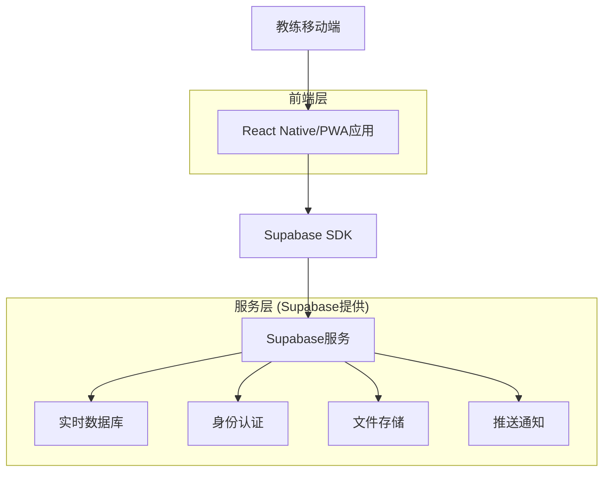
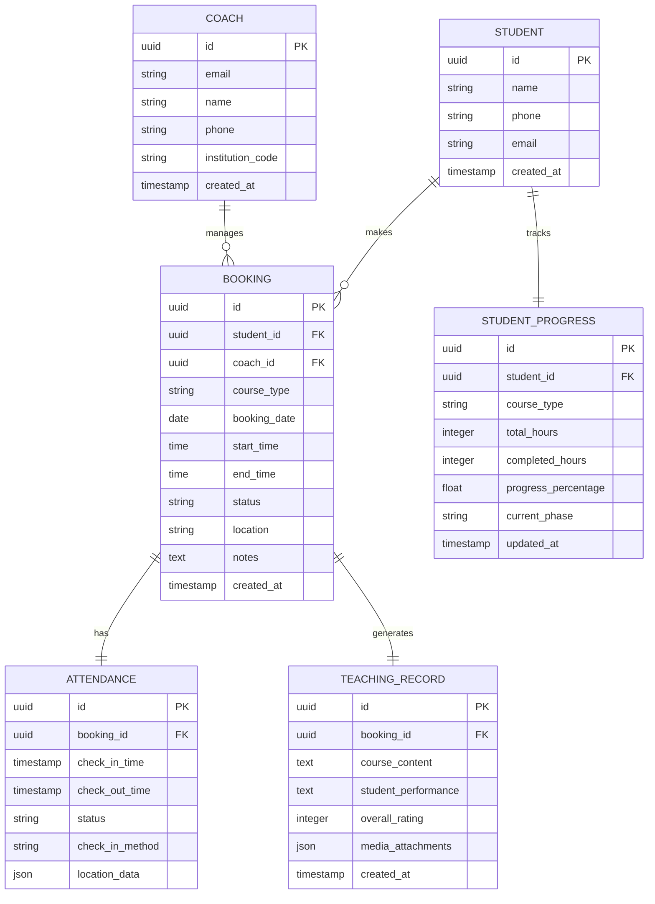

# 易飞行教练端移动应用技术架构文档

## 1. 架构设计



## 2. 技术描述

* **前端**: React Native\@0.72 + NativeBase\@3.4 + React Navigation\@6

* **状态管理**: Zustand\@4.4

* **数据库**: Supabase (PostgreSQL)

* **身份认证**: Supabase Auth

* **文件存储**: Supabase Storage

* **推送通知**: Expo Notifications

* **离线存储**: AsyncStorage + SQLite

## 3. 路由定义

| 路由                   | 用途               |
| -------------------- | ---------------- |
| /login               | 教练登录页面，支持邀请码注册   |
| /home                | 首页，显示今日预约和快捷操作   |
| /bookings            | 预约管理页面，处理学员预约    |
| /bookings/:id        | 预约详情页面，查看和编辑预约信息 |
| /cancellations       | 取消预约处理页面         |
| /checkin             | 培训签到页面，扫码和手动签到   |
| /schedule            | 时段管理页面，设置可预约时间   |
| /records             | 教学记录页面，记录培训内容    |
| /records/new         | 新建教学记录页面         |
| /progress            | 学员进度页面，查看学习进度    |
| /progress/:studentId | 学员详细进度页面         |
| /profile             | 教练个人资料页面         |

## 4. API定义

### 4.1 核心API

**预约管理相关**

```
GET /api/bookings
```

请求参数:

| 参数名    | 参数类型   | 是否必需  | 描述     |
| ------ | ------ | ----- | ------ |
| status | string | false | 预约状态筛选 |
| date   | string | false | 日期筛选   |
| page   | number | false | 分页页码   |

响应:

| 参数名      | 参数类型   | 描述   |
| -------- | ------ | ---- |
| bookings | array  | 预约列表 |
| total    | number | 总数量  |

**签到管理相关**

```
POST /api/checkin
```

请求:

| 参数名               | 参数类型   | 是否必需  | 描述   |
| ----------------- | ------ | ----- | ---- |
| booking\_id       | string | true  | 预约ID |
| student\_id       | string | true  | 学员ID |
| check\_in\_method | string | true  | 签到方式 |
| location          | object | false | 位置信息 |

响应:

| 参数名            | 参数类型    | 描述     |
| -------------- | ------- | ------ |
| success        | boolean | 签到是否成功 |
| attendance\_id | string  | 签到记录ID |

**教学记录相关**

```
POST /api/teaching-records
```

请求:

| 参数名                  | 参数类型   | 是否必需  | 描述   |
| -------------------- | ------ | ----- | ---- |
| booking\_id          | string | true  | 预约ID |
| course\_content      | string | true  | 课程内容 |
| student\_performance | string | true  | 学员表现 |
| overall\_rating      | number | true  | 整体评分 |
| media\_files         | array  | false | 媒体文件 |

## 5. 数据模型

### 5.1 数据模型定义



### 5.2 数据定义语言

**教练表 (coaches)**

```sql
CREATE TABLE coaches (
    id UUID PRIMARY KEY DEFAULT gen_random_uuid(),
    email VARCHAR(255) UNIQUE NOT NULL,
    name VARCHAR(100) NOT NULL,
    phone VARCHAR(20),
    institution_code VARCHAR(50),
    created_at TIMESTAMP WITH TIME ZONE DEFAULT NOW(),
    updated_at TIMESTAMP WITH TIME ZONE DEFAULT NOW()
);

-- 权限设置
GRANT SELECT ON coaches TO anon;
GRANT ALL PRIVILEGES ON coaches TO authenticated;
```

**预约表 (bookings)**

```sql
CREATE TABLE bookings (
    id UUID PRIMARY KEY DEFAULT gen_random_uuid(),
    student_id UUID REFERENCES students(id),
    coach_id UUID REFERENCES coaches(id),
    course_type VARCHAR(50) NOT NULL,
    booking_date DATE NOT NULL,
    start_time TIME NOT NULL,
    end_time TIME NOT NULL,
    status VARCHAR(20) DEFAULT 'pending' CHECK (status IN ('pending', 'confirmed', 'cancelled', 'completed')),
    location VARCHAR(200),
    notes TEXT,
    created_at TIMESTAMP WITH TIME ZONE DEFAULT NOW(),
    updated_at TIMESTAMP WITH TIME ZONE DEFAULT NOW()
);

-- 索引
CREATE INDEX idx_bookings_coach_date ON bookings(coach_id, booking_date);
CREATE INDEX idx_bookings_status ON bookings(status);

-- 权限设置
GRANT SELECT ON bookings TO anon;
GRANT ALL PRIVILEGES ON bookings TO authenticated;
```

**签到记录表 (attendance\_records)**

```sql
CREATE TABLE attendance_records (
    id UUID PRIMARY KEY DEFAULT gen_random_uuid(),
    booking_id UUID REFERENCES bookings(id),
    check_in_time TIMESTAMP WITH TIME ZONE,
    check_out_time TIMESTAMP WITH TIME ZONE,
    status VARCHAR(20) DEFAULT 'present' CHECK (status IN ('present', 'late', 'absent', 'early_leave')),
    check_in_method VARCHAR(20) DEFAULT 'manual' CHECK (check_in_method IN ('qr_code', 'manual', 'nfc')),
    location_data JSONB,
    notes TEXT,
    created_at TIMESTAMP WITH TIME ZONE DEFAULT NOW()
);

-- 权限设置
GRANT SELECT ON attendance_records TO anon;
GRANT ALL PRIVILEGES ON attendance_records TO authenticated;
```

**教学记录表 (teaching\_records)**

```sql
CREATE TABLE teaching_records (
    id UUID PRIMARY KEY DEFAULT gen_random_uuid(),
    booking_id UUID REFERENCES bookings(id),
    course_content TEXT NOT NULL,
    student_performance TEXT,
    overall_rating INTEGER CHECK (overall_rating >= 1 AND overall_rating <= 10),
    media_attachments JSONB DEFAULT '[]',
    weather_conditions VARCHAR(100),
    safety_incidents TEXT,
    next_focus_areas TEXT,
    created_at TIMESTAMP WITH TIME ZONE DEFAULT NOW()
);

-- 权限设置
GRANT SELECT ON teaching_records TO anon;
GRANT ALL PRIVILEGES ON teaching_records TO authenticated;
```

**学员进度表 (student\_progress)**

```sql
CREATE TABLE student_progress (
    id UUID PRIMARY KEY DEFAULT gen_random_uuid(),
    student_id UUID REFERENCES students(id),
    course_type VARCHAR(50) NOT NULL,
    total_required_hours INTEGER DEFAULT 0,
    completed_hours INTEGER DEFAULT 0,
    progress_percentage DECIMAL(5,2) DEFAULT 0.00,
    current_phase VARCHAR(50),
    phase_completion JSONB DEFAULT '{}',
    last_training_date DATE,
    estimated_completion_date DATE,
    status VARCHAR(20) DEFAULT 'active' CHECK (status IN ('active', 'suspended', 'completed', 'dropped')),
    updated_at TIMESTAMP WITH TIME ZONE DEFAULT NOW()
);

-- 索引
CREATE INDEX idx_student_progress_student_course ON student_progress(student_id, course_type);

-- 权限设置
GRANT SELECT ON student_progress TO anon;
GRANT ALL PRIVILEGES ON student_progress TO authenticated;
```

**初始化数据**

```sql
-- 插入示例教练数据
INSERT INTO coaches (email, name, phone, institution_code) VALUES
('coach1@example.com', '张教练', '13800138001', 'INST001'),
('coach2@example.com', '李教练', '13800138002', 'INST001');

-- 插入示例学员数据
INSERT INTO students (name, phone, email) VALUES
('王学员', '13900139001', 'student1@example.com'),
('赵学员', '13900139002', 'student2@example.com');
```

